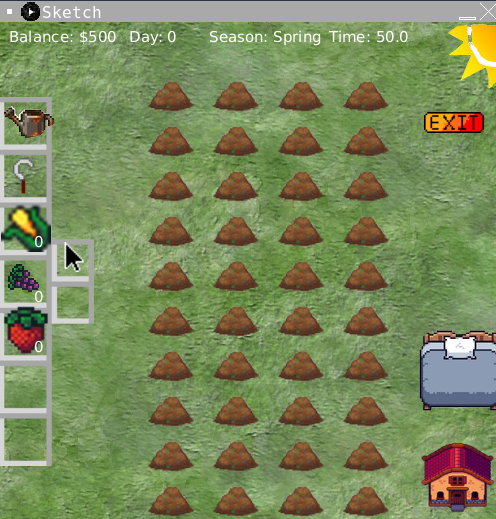
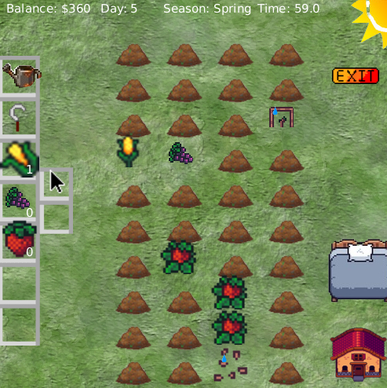
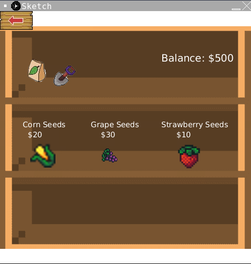

## ICS4U Farming Game
This is a final assignment submitted as my grade 12 computer science in June 2023, made using Processing and Java.

The game simulates a farmer and his cropfield where the objective is to maximize the profit in a given time.
## Screenshots

### Starting Screen

### Planted Crops Screen

### Shop Screen

### Sleep Screen

